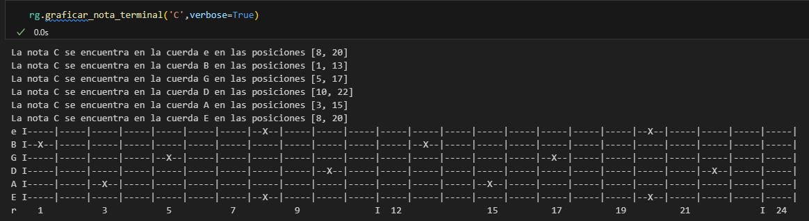
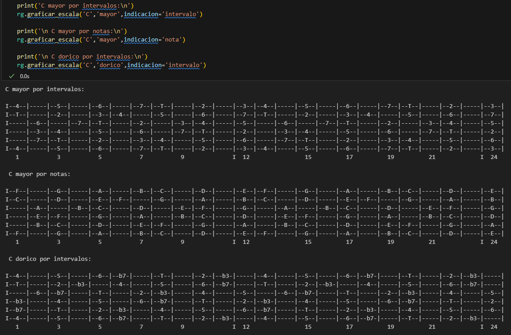
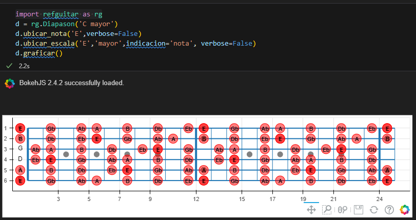
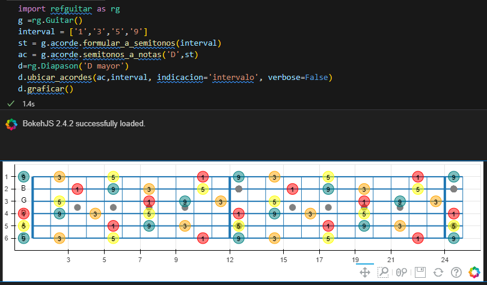
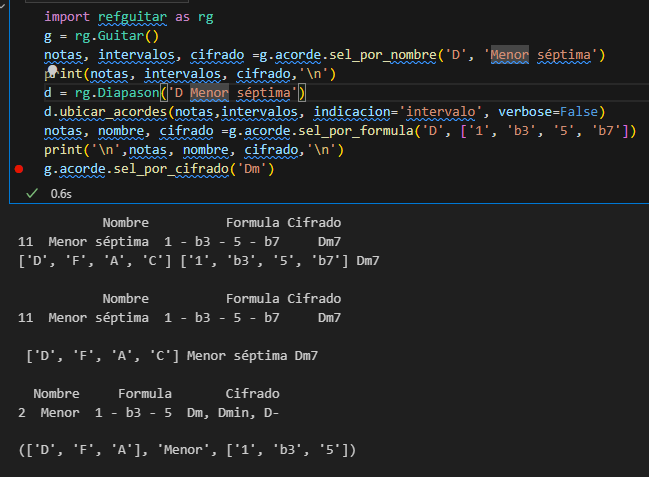

# Musical theory
Es un simple proyecto para generar facilmente material gráfico para el estudio de teoria musical.

# Terminal
Se integran facilidades para la visualización inmediata de información como:

### Ubicación de notas en el diapason

### Diagrama de escalas

# Diagramas editables en Bokeh
- Se grafican:
    - notas
    - escalas modales
    - acordes arbitrarios por intervalos

- Se dispone de una lista de acordes:
    - por intervalos
    - por nombre
    - por cifrado

Por lo pronto, queda deprecada la opcion de acordes en terminal.
